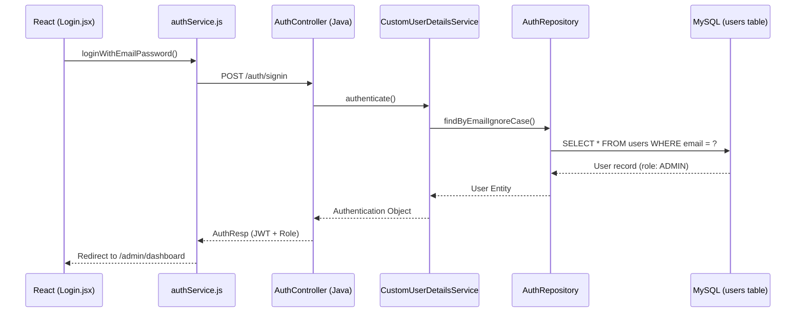

# Login Flow: From Frontend to Database

To login as a **`ROLE_ADMIN`**, the application follows a specific path through the frontend, backend, and finally the database.

## 1. Frontend (React Application)

The journey starts in the browser when you click the "Sign In" button.

- **File**: [`Login.jsx`](file:///c:/MyGit/Online-Examination-Portal/frontend-Application/src/components/HomePage.jsx/login.jsx)
  - The `handleLogin` function is triggered on form submission.
  - It calls the `loginWithEmailPassword` service with your credentials.
- **File**: [`authService.js`](file:///c:/MyGit/Online-Examination-Portal/frontend-Application/src/services/auth/authService.js)
  - This service uses `axiosClient` to make a POST request to the backend.
  - **Endpoint**: `POST http://localhost:8080/oep/auth/signin`
- **File**: [`axiosClient.js`](file:///c:/MyGit/Online-Examination-Portal/frontend-Application/src/services/axios/axiosClient.js)
  - Defines the `baseURL` which points to the **Spring Boot** backend.

## 2. Backend (Java Spring Boot)

The request is received by the Spring Boot server.

- **File**: [`AuthController.java`](file:///c:/MyGit/Online-Examination-Portal/oep_spring_backend/src/main/java/com/oep/controller/AuthController.java)
  - The `userSignIn` method handles the `/auth/signin` request.
  - It delegates authentication to Spring Security's `AuthenticationManager`.
- **File**: [`CustomUserDetailsServiceImpl.java`](file:///c:/MyGit/Online-Examination-Portal/oep_spring_backend/src/main/java/com/oep/security/CustomUserDetailsServiceImpl.java)
  - Spring Security calls `loadUserByUsername(email)`.
  - This method fetches the user details from the database using the repository.

## 3. Database Layer

Finally, the query reaches the database.

- **File**: [`AuthRepository.java`](file:///c:/MyGit/Online-Examination-Portal/oep_spring_backend/src/main/java/com/oep/repository/AuthRepository.java)
  - It uses the method `findByEmailIgnoreCase(email)`.
- **Database Query (SQL)**:
  - Spring Data JPA generates an underlying SQL query similar to:
    ```sql
    SELECT * FROM users WHERE LOWER(email) = LOWER('admin@example.com');
    ```
- **File**: [`User.java`](file:///c:/MyGit/Online-Examination-Portal/oep_spring_backend/src/main/java/com/oep/entities/User.java)
  - The `users` table contains a `role` column.
  - For an admin user, this column stores the value corresponding to **`ROLE_ADMIN`**.

## Summary Diagram


